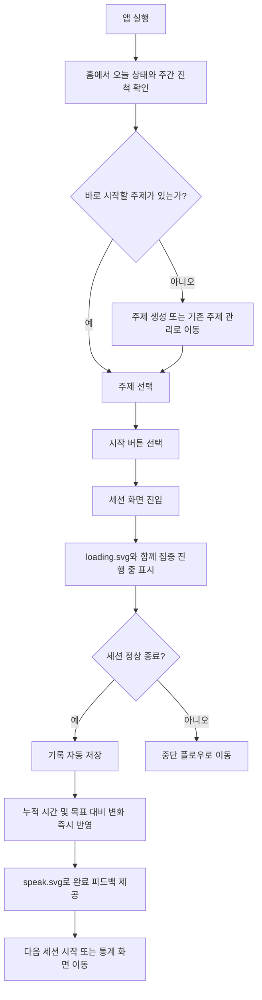
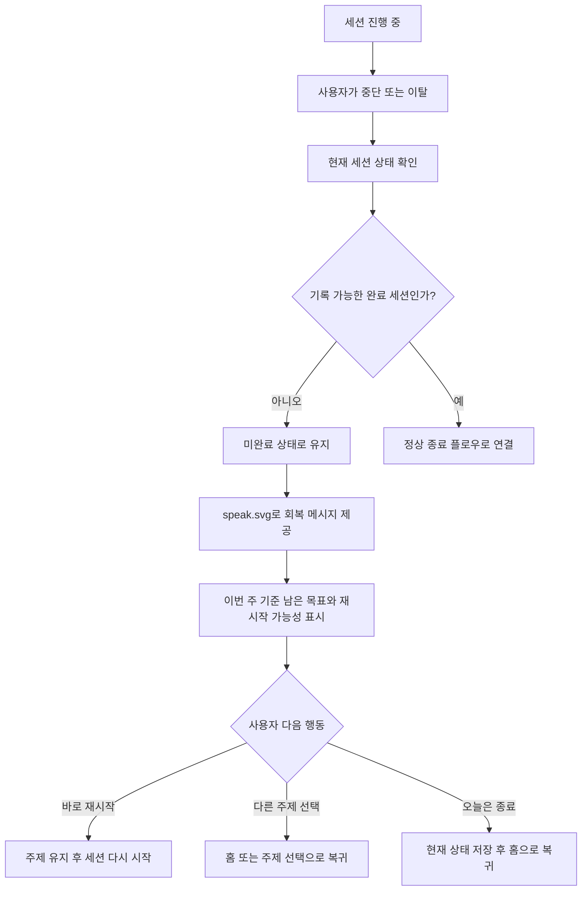
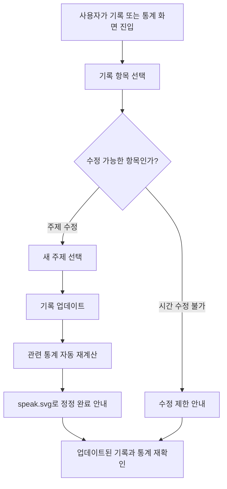

---
stepsCompleted:
  - step-01-init
  - step-02-discovery
  - step-03-core-experience
  - step-04-emotional-response
  - step-05-inspiration
  - step-06-design-system
  - step-07-defining-experience
  - step-08-visual-foundation
  - step-09-design-directions
  - step-10-user-journeys
  - step-11-component-strategy
  - step-12-ux-patterns
  - step-13-responsive-accessibility
  - step-14-complete
inputDocuments:
  - /Users/imseungmin/work/bmad_test/_bmad-output/planning-artifacts/product-brief-bmad_test-2026-03-15.md
  - /Users/imseungmin/work/bmad_test/_bmad-output/planning-artifacts/prd.md
lastStep: 14
---

# UX Design Specification bmad_test

**Author:** Imseungmin
**Date:** 2026-03-17

---

<!-- UX design content will be appended sequentially through collaborative workflow steps -->

## Executive Summary

### Project Vision

bmad_test는 자기주도 학습자가 자신의 학습 시간을 단순 측정하는 수준을 넘어, 주제별 기록과 주간 목표 대비 진척을 구조적으로 이해하도록 돕는 macOS 기반 학습 운영 앱이다. UX의 핵심 목표는 사용자가 앱을 열었을 때 오늘 상태와 이번 주 흐름을 즉시 파악하고, 부담 없이 학습을 시작하고, 학습 후에는 실제로 전진했다는 감각을 얻도록 만드는 것이다.

### Target Users

주요 사용자는 자기주도적으로 공부를 지속하는 개인 학습자다. 이들은 일반 타이머 앱만으로는 목표 추적이 부족하다고 느끼고, 수기 기록은 번거롭다고 느낀다. 복잡한 생산성 시스템보다는 빠르게 열고 바로 사용할 수 있는 가벼운 도구를 선호하며, 하루 성과보다 주간 기준의 누적 진척을 보고 꾸준함을 유지하고 싶어 한다.

### Key Design Challenges

이 제품의 주요 UX 과제는 타이머, 주제 선택, 목표 관리, 통계를 하나의 일관된 학습 운영 흐름으로 통합하는 것이다. 또한 세션 중단, 목표 미달, 잘못된 주제 선택 같은 예외 상황에서도 사용자가 실패감을 느끼지 않고 다시 이어갈 수 있도록 설계해야 한다. 마지막으로 기록 수정이 쉬우면서도 통계 신뢰성이 흔들리지 않는 경험을 제공해야 한다.

### Design Opportunities

첫 화면에서 오늘 진행 상황과 이번 주 목표 대비 진척을 함께 보여주면 제품의 핵심 가치가 즉시 전달될 수 있다. 세션 완료 후 즉시 갱신되는 통계와 진척 피드백은 사용자가 단순히 시간을 보낸 것이 아니라 실제로 목표를 향해 전진하고 있음을 느끼게 만드는 중요한 접점이 된다. 또한 macOS 단일 플랫폼에 맞춘 가볍고 빠른 상호작용은 제품 신뢰감과 반복 사용성을 강화하는 차별점이 될 수 있다.

## Core User Experience

### Defining Experience

bmad_test의 핵심 경험은 사용자가 앱을 열었을 때 오늘 학습 상태와 이번 주 목표 대비 진척을 즉시 이해하고, 별도의 준비 부담 없이 주제를 선택해 바로 학습 세션을 시작하며, 세션 종료 직후 자신의 전진 상황을 명확하게 확인하는 것이다. 제품의 가치는 타이머 실행 그 자체보다 학습 운영 루프를 자연스럽게 연결하는 데서 나온다.

### Platform Strategy

제품은 macOS 전용 데스크톱 앱으로 설계한다. 주 사용 방식은 마우스와 키보드 기반이며, 빠른 실행과 즉각적인 반응이 중요하다. 핵심 기능은 오프라인 환경에서도 모두 동작해야 하며, 로그인이나 네트워크 연결 없이도 세션 실행, 기록 저장, 목표 확인, 통계 조회가 가능해야 한다. UX는 웹 서비스형 복잡한 설정 경험보다 가볍고 즉시 사용 가능한 개인 도구에 맞춰야 한다.

### Effortless Interactions

사용자는 앱을 열자마자 오늘 진행 상황과 주간 진척을 바로 이해할 수 있어야 한다. 주제 선택과 타이머 시작은 거의 한 흐름처럼 느껴질 정도로 단순해야 하며, 세션 완료 후 기록 저장과 통계 반영은 별도 조작 없이 자동으로 이뤄져야 한다. 또한 잘못 선택한 주제의 정정, 세션 중단 후 상태 확인 같은 예외 처리도 복잡한 탐색 없이 빠르게 수행할 수 있어야 한다.

### Critical Success Moments

가장 중요한 성공 순간은 사용자가 세션 종료 후 "나는 그냥 시간을 보낸 게 아니라 이번 주 목표를 향해 실제로 전진했다"는 감각을 얻는 순간이다. 또 첫 실행 또는 첫 사용 초반에 메인 화면만 보고도 오늘 상태와 이번 주 흐름을 이해할 수 있어야 제품 차별점이 전달된다. 반대로 주제 선택이 번거롭거나 세션 기록과 통계 반영이 불명확하면 경험 전체 신뢰가 무너질 수 있다.

### Experience Principles

- 학습 시작 전 판단은 빠르고 가볍게 만든다.
- 세션 실행 중에는 방해를 줄이고 집중 상태를 유지한다.
- 세션 종료 후에는 진척과 성취를 즉시 해석하게 돕는다.
- 예외 상황에서도 실패감보다 회복 가능성을 먼저 전달한다.

## Desired Emotional Response

### Primary Emotional Goals

bmad_test가 사용자에게 주어야 하는 가장 중요한 감정은 자신의 학습 흐름을 스스로 관리하고 있다는 통제감이다. 사용자는 앱을 쓸 때 조급함보다는 차분함을 느껴야 하며, 세션을 마친 뒤에는 작더라도 실제로 전진했다는 성취감을 얻어야 한다. 이 제품은 압박으로 밀어붙이는 도구가 아니라, 꾸준함을 유지하도록 돕는 신뢰 가능한 운영 도구처럼 느껴져야 한다.

### Emotional Journey Mapping

사용자는 앱을 처음 열었을 때 복잡함 없이 현재 상태를 이해하며 안도감을 느껴야 한다. 학습 세션을 시작할 때는 준비가 끝났다는 명확함과 가벼운 몰입감을 느껴야 하며, 세션 진행 중에는 방해받지 않는 집중 상태를 유지해야 한다. 세션 종료 후에는 결과가 즉시 반영되면서 전진하고 있다는 성취감을 느껴야 한다. 목표를 채우지 못했거나 세션이 중단된 상황에서는 실패감보다 다시 이어갈 수 있다는 회복 가능성을 느껴야 하며, 다음에 다시 앱을 열었을 때도 부담보다 지속성을 떠올리게 해야 한다.

### Micro-Emotions

이 제품에서 특히 중요한 미세 감정은 혼란보다 명확함, 불신보다 신뢰, 압박감보다 안정감, 좌절보다 회복 가능성이다. 사용자는 주제 선택, 진행 상황 확인, 기록 정정 같은 순간마다 "이 앱은 내 상태를 정확히 알고 있다"는 느낌을 받아야 한다. 세션 종료 직후에는 큰 보상보다 조용하지만 분명한 만족감이 적절하다.

### Design Implications

통제감과 신뢰를 만들기 위해 메인 화면은 현재 상태와 주간 진척을 즉시 이해할 수 있도록 단순하고 명확해야 한다. 안정감과 집중감을 만들기 위해 세션 중 UI는 불필요한 정보와 시각적 소음을 줄여야 한다. 성취감과 전진 감각을 만들기 위해 세션 완료 후에는 기록 저장, 누적 시간 반영, 목표 대비 변화가 즉시 드러나야 한다. 회복 가능성을 만들기 위해 목표 미달이나 세션 중단 상황에서는 경고성 표현보다 "이번 주 기준으로 다시 이어갈 수 있음"을 보여주는 정보 구조와 문구가 필요하다.

### Emotional Design Principles

- 사용자가 자신의 학습 상태를 바로 이해하게 해 불안을 줄인다.
- 작은 완료도 전진으로 해석하게 만들어 성취감을 축적한다.
- 예외 상황에서는 비난하지 않고 다시 시작할 기준점을 제공한다.
- 모든 핵심 화면은 신뢰 가능하고 차분한 도구처럼 느껴지게 설계한다.

## UX Pattern Analysis & Inspiration

### Inspiring Products Analysis

bmad_test에 참고할 만한 제품군은 크게 세 가지다. 첫째, 포모도로 중심의 집중 앱들은 세션 시작과 진행 상태 표시를 단순하게 유지하는 데 강점이 있다. 둘째, 개인 목표 추적 앱들은 누적 진척과 달성률을 직관적으로 보여주는 정보 구조에 강점이 있다. 셋째, 개인 지식 또는 작업 관리 도구들은 빠른 진입, 명확한 탐색, 수정 가능한 기록 구조에서 배울 점이 있다. 이 제품은 이 세 가지의 장점을 결합하되, 기능 과잉 없이 학습 운영 루프에만 집중해야 한다.

### Transferable UX Patterns

핵심 화면에서 현재 상태와 다음 행동을 함께 보여주는 대시보드 패턴은 그대로 가져올 가치가 크다. 사용자가 앱을 열자마자 오늘 진행 상황과 이번 주 목표 대비 진척을 이해하고, 바로 주제를 선택해 세션을 시작할 수 있어야 하기 때문이다. 또 세션 완료 직후 자동 저장과 즉시 반영 피드백 패턴도 중요하다. 사용자는 저장 버튼을 누르지 않아도 결과가 반영되고, 그 변화가 눈에 보여야 한다. 마지막으로 관리 화면과 실행 화면을 분리하되, 이동 구조는 단순하게 유지하는 패턴이 적합하다. 주제 관리와 통계는 독립된 영역이어야 하지만, 핵심 학습 루프를 방해해서는 안 된다.

### Anti-Patterns to Avoid

첫째, 타이머 앱처럼 보이지만 실제로는 설정과 옵션이 과도하게 많은 구조는 피해야 한다. 이 제품의 가치는 빠른 시작과 학습 흐름 유지에 있기 때문이다. 둘째, 통계를 지나치게 복잡한 차트와 세부 지표로 보여주는 방식도 MVP에는 맞지 않는다. 사용자는 정교한 분석보다 이번 주 기준으로 얼마나 전진했는지를 먼저 알고 싶어 한다. 셋째, 목표 미달이나 세션 중단을 실패처럼 강조하는 피드백은 피해야 한다. 이 제품은 죄책감보다 회복 가능성을 강화해야 한다.

### Design Inspiration Strategy

채택할 것은 단순한 대시보드, 즉시 실행 가능한 핵심 액션, 자동 반영되는 결과 피드백이다. 조정해서 가져올 것은 일반 생산성 앱의 내비게이션 구조와 진행률 표현 방식이며, 학습 도메인에 맞게 더 차분하고 해석 중심으로 바꿔야 한다. 피해야 할 것은 게임화 과잉, 통계 과잉, 설정 과잉이다. bmad_test는 화려한 생산성 도구가 아니라, 사용자가 자신의 학습을 신뢰하고 이어가게 만드는 조용한 운영 도구로 남아야 한다.

## Design System Foundation

### 1.1 Design System Choice

bmad_test는 macOS 데스크톱 앱 문맥에 맞춘 경량 커스텀 디자인 시스템을 채택한다. 기본 방향은 macOS 사용자에게 익숙한 명료함과 안정감을 유지하면서, `default.svg`, `speak.svg`, `loading.svg` 캐릭터 자산을 핵심 상호작용 보조 요소로 활용하는 것이다. 이 캐릭터는 브랜드 장식이 아니라, 사용자 상태 이해와 피드백 전달을 돕는 보조 인터페이스 역할을 맡는다.

### Rationale for Selection

이 프로젝트는 1인 개발 MVP이므로, 범용 시스템 전체를 도입하기보다 필요한 핵심 화면과 컴포넌트만 정교하게 정의하는 편이 효율적이다. 또한 이미 사용할 캐릭터 자산이 정해져 있으므로, 시각적 정체성은 새로운 복잡한 브랜드 시스템보다 캐릭터와 차분한 정보 구조의 조합으로 형성하는 것이 적절하다. macOS 단일 플랫폼이라는 조건도 폭넓은 추상화보다 간결하고 예측 가능한 데스크톱 UI 원칙을 우선하게 만든다.

### Implementation Approach

디자인 시스템은 앱 셸, 내비게이션, 주제 선택 리스트, 타이머 카드, 진행률 요약 블록, 통계 요약 카드, 기록 항목, 상태 피드백 컴포넌트처럼 실제 MVP 핵심 흐름에 필요한 컴포넌트부터 정의한다. 캐릭터 컴포넌트는 별도 상태형 UI 요소로 두고, 기본 대기 상태에서는 `default.svg`, 안내 문구 제시나 세션 종료 피드백처럼 사용자의 주목이 필요한 순간에는 `speak.svg`, 학습 세션이 진행 중일 때는 `loading.svg`를 사용한다. `loading.svg`는 네트워크 로딩 의미가 아니라 현재 세션이 진행 중이고 집중 상태가 유지되고 있음을 보여주는 활동 상태 표시로 사용한다. 캐릭터는 홈, 세션 진행 중, 세션 완료, 빈 상태, 회복 안내 구간에서만 제한적으로 사용해 정보 전달을 강화한다.

### Customization Strategy

커스터마이징은 화려함보다 신뢰감, 차분함, 명확함을 강화하는 방향으로 제한한다. 색상과 레이아웃은 정보 이해 속도를 우선하고, 캐릭터는 감정적 분위기와 안내 톤을 부드럽게 만드는 역할에 집중한다. 특히 목표 미달, 세션 중단, 빈 기록 상태 같은 순간에 캐릭터를 활용하면 실패감 대신 다시 이어갈 수 있다는 메시지를 더 자연스럽게 전달할 수 있다. 학습 진행 중에는 `loading.svg`를 통해 앱이 살아 있고 세션이 계속 흐르고 있다는 점을 조용하게 보여줄 수 있다. 반대로 항상 캐릭터가 말하거나 과도하게 노출되면 집중을 해칠 수 있으므로, 핵심 메시지와 상태 전환 순간에만 사용하는 것이 원칙이다.

## 2. Core User Experience

### 2.1 Defining Experience

bmad_test의 defining experience는 사용자가 앱을 열고 현재 학습 상태를 즉시 이해한 뒤, 주제를 선택해 바로 세션을 시작하고, 세션이 끝나면 자신의 전진 상황을 명확하게 확인하는 흐름이다. 이 경험의 핵심은 복잡한 설정 없이 학습을 시작하게 하고, 종료 직후에는 기록과 진척이 하나의 자연스러운 결과처럼 보이게 만드는 것이다. 캐릭터는 이 흐름에서 필요한 순간에만 등장해 상태를 부드럽게 설명하고, 사용자의 해석 부담을 줄이는 역할을 한다.

### 2.2 User Mental Model

사용자는 현재 이 문제를 일반 타이머 앱, 메모, 수기 기록, 머릿속 추적으로 해결하고 있을 가능성이 크다. 그래서 앱을 열었을 때 가장 먼저 기대하는 것은 "지금 내가 어느 정도 하고 있는지"를 바로 아는 것이다. 또한 학습 시작은 최대한 빠르고 간단해야 하며, 기록은 자동으로 남기를 기대한다. 사용자가 가장 혼란스러워할 수 있는 지점은 주제 선택이 실제 기록과 어떻게 연결되는지, 세션 중단이나 수정이 통계에 어떤 영향을 주는지다. 따라서 시스템은 학습 흐름과 기록 반영 관계를 항상 명확하게 보여줘야 한다.

### 2.3 Success Criteria

성공적인 핵심 경험은 사용자가 앱 실행 후 짧은 시간 안에 오늘 상태와 주간 진척을 이해하고, 몇 번의 조작만으로 주제를 선택해 세션을 시작할 수 있을 때 성립한다. 세션 진행 중에는 현재 주제와 남은 시간이 분명하게 유지되고, `loading.svg` 상태가 학습 흐름이 정상적으로 진행 중임을 조용하게 보여줘야 한다. 세션 종료 후에는 결과가 자동 저장되고, 누적 시간과 목표 대비 변화가 즉시 반영되어야 한다. 사용자는 별도 설명 없이도 지금 무엇을 해야 하는지 이해해야 하며, 잘못된 주제 선택이나 중단 상황에서도 흐름을 잃지 않아야 한다.

### 2.4 Novel UX Patterns

이 경험은 완전히 새로운 상호작용을 요구하지 않는다. 주제 선택, 타이머 실행, 진행률 확인, 기록 반영은 모두 사용자가 이미 익숙한 패턴을 활용할 수 있다. 차별점은 이 익숙한 패턴들을 하나의 학습 운영 루프로 결합하고, 캐릭터를 상태 전달 보조 장치로 제한적으로 배치하는 방식에 있다. 즉, 기본은 친숙한 UX를 유지하고, 해석과 감정 톤에서만 제품 고유의 개성을 만든다.

### 2.5 Experience Mechanics

1. Initiation:
사용자가 앱을 열면 홈에서 오늘 진행 상황과 이번 주 진척을 먼저 본다. 캐릭터는 기본적으로 `default.svg` 상태로 배치되어 현재 상태를 방해 없이 보조한다.

2. Interaction:
사용자는 주제를 선택하고 바로 세션을 시작한다. 세션 중 화면은 집중을 해치지 않도록 단순하게 유지하며, 타이머와 현재 주제만 중심에 둔다. 이때 캐릭터는 `loading.svg` 상태로 전환되어 세션이 살아 있고 학습이 진행 중임을 조용하게 표시한다.

3. Feedback:
세션이 정상적으로 끝나면 기록은 자동 저장되고, 누적 시간과 목표 대비 변화가 즉시 갱신된다. 이 순간 캐릭터는 `speak.svg` 상태로 전환되어 짧고 명확한 피드백을 제공할 수 있다. 세션 중단이나 목표 미달 상황에서는 비난 대신 회복 가능한 다음 행동을 안내한다.

4. Completion:
사용자는 세션이 끝난 뒤 자신이 얼마나 전진했는지 바로 이해하고, 이어서 다음 세션을 시작하거나 통계 화면으로 이동할 수 있다. 핵심 완료 감각은 "끝났다"보다 "이번 주 목표를 향해 한 걸음 나아갔다"는 해석에서 나온다.

## Visual Design Foundation

### Color System

컬러 시스템은 과한 생산성 앱 느낌보다 차분한 학습 운영 도구의 성격을 우선한다. 기본 배경은 밝고 부드러운 뉴트럴 톤으로 유지하고, 주요 정보 계층은 저채도의 블루 또는 틸 계열을 중심 축으로 잡는 것이 적절하다. 진행 상태와 주간 진척에는 안정적인 포인트 컬러를 사용하되, 성공 상태는 과도한 축하색보다 조용한 성취감을 주는 방향으로 제한한다. 경고와 오류 색상은 분명해야 하지만, 목표 미달이나 세션 중단을 실패처럼 보이게 하지 않도록 공격적인 빨강 사용은 최소화한다. 캐릭터 SVG의 시각적 존재감이 있으므로, 나머지 UI 컬러는 이를 방해하지 않는 절제된 팔레트로 구성한다.

### Typography System

타이포그래피는 친근함보다 명확함과 가독성을 우선한다. macOS 데스크톱 앱 문맥에 맞게 시스템 친화적인 산세리프 계열을 사용하고, 숫자 정보와 시간 정보는 빠르게 읽히는 계층을 분명히 둔다. 큰 헤드라인보다는 화면 내 상태 요약, 남은 시간, 진행률, 주제명, 보조 설명이 안정적으로 읽히는 구조가 중요하다. 타이머와 누적 시간처럼 핵심 수치 정보는 시각적 우선순위를 가장 높게 두고, 캐릭터가 말하는 짧은 피드백 문구는 본문보다 약간 강조된 보조 계층으로 배치한다.

### Spacing & Layout Foundation

레이아웃은 넓게 펼친 대시보드형이 아니라, 한 번에 현재 상태와 다음 행동이 읽히는 중밀도 구조가 적합하다. 기본 spacing unit은 8px 계열로 두고, 카드 내부와 섹션 간 간격은 명확히 구분해 정보 그룹이 자연스럽게 보이도록 한다. 홈 화면은 오늘 상태, 주간 진척, 주제 선택, 시작 액션이 시선 흐름상 위에서 아래로 자연스럽게 이어져야 한다. 세션 진행 화면은 더 밀도 낮고 집중 중심으로 바꾸어, 타이머와 현재 주제, 진행 상태만 남기고 나머지 정보는 뒤로 물린다.

### Accessibility Considerations

텍스트와 배경의 대비는 기본적으로 충분히 확보해야 하며, 상태 표현은 색상에만 의존하지 않아야 한다. 특히 진행 상태, 세션 완료, 중단 상태, 목표 미달 안내는 아이콘, 문구, 레이아웃 변화까지 함께 사용해 전달해야 한다. 타이머와 주요 수치 정보는 멀리서도 빠르게 읽히는 크기와 대비를 가져야 하며, 캐릭터 상태 변화도 단순 장식이 아니라 문구와 함께 제공되어 의미가 분명해야 한다. `loading.svg`는 로딩 오해를 막기 위해 반드시 "집중 진행 중" 같은 명시적 텍스트와 함께 써야 한다.

## Design Direction Decision

### Design Directions Explored

이번 단계에서는 세 가지 방향을 우선 탐색하는 것이 적절하다. 첫 번째는 정보 우선형 대시보드 방향으로, 오늘 상태와 주간 진척을 가장 먼저 읽게 만드는 구조다. 두 번째는 집중 우선형 방향으로, 홈과 세션 화면의 대비를 크게 두어 학습 시작 전과 진행 중 경험을 명확히 분리한다. 세 번째는 캐릭터 보조형 방향으로, `default.svg`, `loading.svg`, `speak.svg`를 더 적극적으로 활용해 상태 전환과 피드백을 따뜻하게 전달하는 구조다.

### Chosen Direction

현재 제품 목표와 캐릭터 자산 구성을 기준으로 보면, 가장 적합한 방향은 정보 우선형 대시보드를 기반으로 하되 캐릭터 보조형 요소를 제한적으로 결합하는 방식이다. 즉, 메인 구조는 정보 해석이 빠른 대시보드형으로 유지하고, 캐릭터는 홈의 상태 보조, 세션 진행 중 활동 표시, 완료 후 피드백에만 개입하는 방향이 적합하다.

### Design Rationale

이 방향은 제품의 핵심 가치인 "지금 상태를 이해하고 바로 시작하며, 끝난 뒤 전진을 확인한다"는 루프를 가장 잘 드러낸다. 정보 우선 구조만으로는 제품이 차가워질 수 있고, 반대로 캐릭터를 전면에 세우면 집중 도구로서의 신뢰감이 떨어질 수 있다. 따라서 정보 중심 구조 위에 캐릭터를 보조 계층으로 두는 것이 가장 균형이 좋다. 이 방식은 1인 개발 MVP 범위에도 맞고, 추후 캐릭터 활용 범위를 늘리거나 줄이기도 쉽다.

### Implementation Approach

구현은 홈 화면, 세션 진행 화면, 세션 완료 피드백 화면을 우선 기준 화면으로 삼아 진행한다. 홈에서는 `default.svg`를 활용해 현재 상태를 보조하고, 세션 진행 중에는 `loading.svg`를 집중 상태 신호로 사용하며, 완료 및 회복 메시지에서는 `speak.svg`를 사용한다. 전체 레이아웃은 차분한 대시보드 구조를 유지하고, 캐릭터는 정보 전달을 강화하는 보조 장치로만 배치한다.

## User Journey Flows

### 핵심 학습 시작 플로우

사용자는 홈에서 오늘 진행 상황과 이번 주 진척을 확인한 뒤, 주제를 선택하고 바로 세션을 시작한다. 이 플로우의 목표는 해석과 실행 사이의 마찰을 줄여, 사용자가 앱을 켠 뒤 빠르게 학습 상태로 들어가게 만드는 것이다.

이 플로우의 핵심 최적화는 홈에서 너무 많은 결정을 요구하지 않는 것이다. 사용자는 현재 상태를 이해하고, 주제를 고르고, 시작하는 세 단계만 빠르게 지나가야 한다.

### 세션 중단 및 회복 플로우

사용자는 세션 도중 학습을 멈추거나 끝까지 완료하지 못할 수 있다. 이 플로우의 목표는 중단을 실패처럼 느끼게 하지 않고, 현재 상태를 이해하고 다시 이어갈 수 있는 기준점을 제공하는 것이다.

이 플로우에서는 경고 문구보다 회복 문구가 우선이다. 사용자에게 필요한 것은 비난이 아니라, "지금 여기서 다시 시작할 수 있다"는 해석이다.

### 기록 정정 플로우

사용자는 잘못된 주제를 선택했거나 기록된 결과를 수정해야 할 수 있다. 이 플로우의 목표는 수정 자체를 간단하게 만들면서도 통계 신뢰성을 유지하는 것이다.

여기서는 사용자가 "무엇을 수정할 수 있고 무엇은 수정할 수 없는지"를 즉시 이해해야 한다. 수정 가능 범위를 명확히 제한하는 것이 오히려 신뢰를 높인다.

### Journey Patterns

공통적으로 모든 플로우는 `현재 상태 이해 -> 최소한의 선택 -> 자동 반영 -> 명확한 피드백` 구조를 따른다.

**Navigation Patterns**
- 홈은 항상 현재 상태와 다음 행동의 출발점이 된다.
- 세션 종료 후에는 홈 복귀보다 다음 행동 선택지를 직접 보여준다.

**Decision Patterns**
- 사용자가 한 번에 내려야 하는 결정 수를 최소화한다.
- 수정 가능 범위와 불가능 범위를 명확히 구분한다.

**Feedback Patterns**
- 진행 중에는 `loading.svg`로 조용한 활동 상태를 표시한다.
- 완료, 회복, 정정 순간에는 `speak.svg`와 짧은 문구로 의미를 해석해 준다.

### Flow Optimization Principles

- 사용자를 가능한 빨리 학습 시작 상태로 이동시킨다.
- 세션 중에는 정보 밀도를 줄여 집중을 유지한다.
- 결과 반영은 자동으로 처리하고, 사용자는 해석만 하게 만든다.
- 예외 상황에서는 실패 원인보다 다음 행동을 먼저 보여준다.
- 캐릭터는 흐름을 설명하는 보조 장치로만 사용하고, 주 인터페이스를 대체하지 않는다.

## Component Strategy

### Design System Components

기본 디자인 시스템에서 재사용할 수 있는 토대 컴포넌트는 다음과 같다.

- App Shell
- Sidebar or Tab Navigation
- Primary / Secondary Button
- Text Input
- Select / Dropdown
- Card
- Modal / Dialog
- List Item
- Empty State Container
- Toast or Inline Feedback
- Progress Bar
- Badge / Status Label

이 컴포넌트들은 레이아웃 일관성과 기본 접근성을 담당한다. 다만 bmad_test의 핵심 경험은 일반 컴포넌트 조합만으로는 충분히 표현되지 않기 때문에, 학습 흐름에 특화된 커스텀 컴포넌트가 필요하다.

### Custom Components

### Study Status Summary Card

**Purpose:** 오늘 진행 상황과 이번 주 목표 대비 진척을 한눈에 요약한다.  
**Usage:** 홈 화면 최상단 핵심 정보 블록으로 사용한다.  
**Anatomy:** 오늘 누적 시간, 이번 주 누적 시간, 목표 대비 진행률, 남은 목표, 보조 문구  
**States:** 기본, 목표 달성 근접, 목표 달성, 데이터 없음  
**Variants:** compact, default  
**Accessibility:** 수치 정보는 텍스트로 모두 제공하고 진행률은 색상 외 수치/레이블로도 표현  
**Content Guidelines:** 가장 중요한 수치 하나와 보조 수치 둘 정도로 제한  
**Interaction Behavior:** 클릭 시 통계 화면 또는 상세 진척 보기로 이동 가능

### Topic Quick Select Panel

**Purpose:** 사용자가 빠르게 주제를 선택하고 바로 세션을 시작하게 한다.  
**Usage:** 홈과 세션 시작 직전 구간에서 사용한다.  
**Anatomy:** 주제 리스트, 주간 목표 요약, 최근 선택 표시, 시작 버튼  
**States:** 기본, 선택됨, 선택 불가, 빈 상태  
**Variants:** list, compact grid  
**Accessibility:** 키보드 방향키 및 Enter로 선택 가능해야 함  
**Content Guidelines:** 주제명은 짧고 식별 가능해야 하며, 진행률은 보조 정보로만 노출  
**Interaction Behavior:** 주제 선택 즉시 시작 CTA와 연결

### Session Focus Timer

**Purpose:** 진행 중인 학습 세션의 핵심 상태를 보여준다.  
**Usage:** 세션 진행 화면의 중심 컴포넌트로 사용한다.  
**Anatomy:** 남은 시간, 현재 주제, 세션 상태, 진행 표시, 중단 또는 종료 액션  
**States:** 시작 전, 진행 중, 일시 중단, 완료 직전, 완료  
**Variants:** focus mode only  
**Accessibility:** 시간 정보는 큰 텍스트와 명확한 상태 문구를 함께 제공  
**Content Guidelines:** 타이머 외 부가 정보는 최소화  
**Interaction Behavior:** 시작 후에는 집중 유지가 우선이며 부수 행동은 최소화

### Character State Panel

**Purpose:** 캐릭터를 통해 상태 해설과 짧은 피드백을 제공한다.  
**Usage:** 홈, 세션 진행, 완료 피드백, 빈 상태, 회복 안내 구간  
**Anatomy:** SVG 자산, 짧은 메시지, 보조 상태 라벨  
**States:** `default.svg`, `loading.svg`, `speak.svg`  
**Variants:** inline, side panel, compact bubble  
**Accessibility:** SVG만으로 의미를 전달하지 않고 반드시 텍스트 동반  
**Content Guidelines:** 문구는 짧고 해석 중심이어야 하며 감정 과잉 금지  
**Interaction Behavior:** 사용자의 주의가 필요한 순간에만 상태 전환

### Session Outcome Panel

**Purpose:** 세션 종료 후 전진 결과를 해석해 보여준다.  
**Usage:** 완료 직후 또는 중단 후 회복 구간  
**Anatomy:** 완료 여부, 추가된 시간, 목표 대비 변화, 다음 행동 CTA, 캐릭터 피드백  
**States:** 정상 완료, 중단, 회복 안내  
**Variants:** success, recovery  
**Accessibility:** 결과 요약과 다음 행동을 텍스트로 명확히 제공  
**Content Guidelines:** "얼마나 전진했는지"가 중심이어야 함  
**Interaction Behavior:** 다음 세션 시작 또는 통계 확인으로 자연스럽게 연결

### Record Correction Item

**Purpose:** 기록 수정 플로우를 명확하고 안전하게 제공한다.  
**Usage:** 기록 리스트와 통계 상세 화면  
**Anatomy:** 기록 요약, 수정 가능한 필드, 수정 불가 필드 안내, 저장 결과 피드백  
**States:** 기본, 수정 중, 저장 완료, 제한 안내  
**Variants:** inline edit, modal edit  
**Accessibility:** 수정 가능/불가 상태를 명확히 읽어줄 수 있어야 함  
**Content Guidelines:** 수정 범위는 최소화하고 제한은 명시적으로 안내  
**Interaction Behavior:** 주제 수정 후 통계 재계산 결과를 바로 반영

### Component Implementation Strategy

기본 구조 컴포넌트는 경량 시스템 토큰을 공유하면서 공통 스타일로 관리한다. 반면 커스텀 컴포넌트는 학습 운영 루프에 직접 연결된 도메인 컴포넌트로 정의한다. 모든 커스텀 컴포넌트는 다음 원칙을 따른다.

- 정보 해석이 먼저이고 장식은 나중이다.
- 캐릭터는 보조 인터페이스이며 핵심 정보 컴포넌트를 대체하지 않는다.
- `loading.svg`는 진행 중 상태에만 쓰고 로딩 의미로 쓰지 않는다.
- 수정과 회복 플로우는 제한을 명확히 보여 신뢰를 지킨다.
- 상태 변화는 색상, 텍스트, 레이아웃 변화로 함께 전달한다.

### Implementation Roadmap

**Phase 1 - Core Components**
- Study Status Summary Card
- Topic Quick Select Panel
- Session Focus Timer
- Character State Panel

**Phase 2 - Supporting Components**
- Session Outcome Panel
- Record Correction Item
- Empty State Container with character guidance

**Phase 3 - Enhancement Components**
- Weekly Progress Breakdown Card
- Goal Adjustment Prompt
- Topic Insight Row

## UX Consistency Patterns

### Button Hierarchy

**When to Use:**  
Primary 버튼은 한 화면에서 가장 중요한 다음 행동 하나에만 사용한다. 예를 들어 홈에서는 `세션 시작`, 완료 후에는 `다음 세션 시작` 또는 `통계 보기` 중 하나만 primary가 되어야 한다. Secondary 버튼은 보조 행동, tertiary 또는 text 버튼은 탐색적 행동에 사용한다.

**Visual Design:**  
Primary는 가장 높은 대비와 명확한 채움형 스타일을 사용한다. Secondary는 경계선 또는 약한 채움 스타일을 사용하고, destructive 액션은 빨강을 쓰더라도 최소 범위에만 제한한다.

**Behavior:**  
hover, focus, disabled 상태를 일관되게 유지한다. 한 화면에 primary action은 하나만 존재해야 한다.

**Accessibility:**  
키보드 포커스 링은 항상 분명해야 하며, 버튼 텍스트는 동사 중심으로 작성한다.

**Variants:**  
primary, secondary, text, destructive

### Feedback Patterns

**When to Use:**  
성공, 진행 중, 회복 안내, 제한 안내, 오류 상황에 사용한다.

**Visual Design:**  
진행 중 상태는 `loading.svg`와 함께 조용한 활동 상태로 표현한다. 성공 및 회복 안내는 `speak.svg`와 짧은 해석 문구를 함께 사용한다. 오류는 강한 위협보다 문제 원인과 다음 행동을 먼저 보여준다.

**Behavior:**  
세션 완료 후 피드백은 자동 저장 결과와 함께 즉시 나타나야 한다. 목표 미달이나 세션 중단은 경고보다 회복 가능한 선택지를 먼저 제시한다.

**Accessibility:**  
피드백은 색상에만 의존하지 않고 텍스트를 동반해야 한다. 상태 변화는 스크린 리더가 읽을 수 있어야 한다.

**Variants:**  
success, progress, recovery, restriction, error

### Form Patterns

**When to Use:**  
주제 생성, 주제 수정, 목표 설정, 기록 정정에 사용한다.

**Visual Design:**  
입력 필드는 단순하고 정보 밀도를 낮게 유지한다. 여러 입력을 한 화면에 몰아넣지 않고, 필요한 최소 필드만 노출한다.

**Behavior:**  
가능하면 인라인 검증을 사용하되 사용 흐름을 끊지 않는다. 기록 정정에서는 수정 가능한 필드와 수정 불가 필드를 명확히 구분한다.

**Accessibility:**  
모든 입력에는 레이블이 있어야 하며, 오류 메시지는 필드와 직접 연결되어야 한다.

**Variants:**  
create, edit, restricted edit

### Navigation Patterns

**When to Use:**  
홈, 주제 관리, 통계, 기록 확인 사이 이동에 사용한다.

**Visual Design:**  
주요 내비게이션은 단순한 고정 구조를 유지한다. 홈은 언제나 현재 상태와 다음 행동의 기준점이 된다.

**Behavior:**  
세션 중에는 내비게이션 노출을 줄여 집중을 우선한다. 세션 완료 후에는 홈 복귀만 강요하지 않고 다음 행동 선택지를 직접 제공한다.

**Accessibility:**  
현재 위치는 시각적으로뿐 아니라 텍스트/ARIA 상태로도 구분되어야 한다.

**Variants:**  
main navigation, reduced focus navigation, post-session action navigation

### Additional Patterns

**Empty States and Loading States**
- 빈 상태는 단순 공백으로 두지 않고 `default.svg` 또는 `speak.svg`와 함께 첫 행동을 안내한다.
- `loading.svg`는 데이터 로딩이 아니라 학습 세션 진행 중 상태에만 사용한다.
- 실제 시스템 로딩이 필요할 경우에는 별도의 로딩 인디케이터를 쓰고, 캐릭터 상태와 혼용하지 않는다.

**Record Correction Patterns**
- 사용자가 수정할 수 있는 범위는 작고 분명해야 한다.
- 수정 후에는 통계 재계산 결과를 즉시 보여준다.
- 제한된 수정 항목은 "불가"라고만 하지 말고 이유를 같이 제공한다.

**Character Usage Patterns**
- `default.svg`: 홈, 일반 대기, 빈 상태
- `loading.svg`: 세션 진행 중
- `speak.svg`: 완료 피드백, 회복 안내, 정정 완료 안내
- 캐릭터는 정보 해석을 돕는 보조 요소이며, CTA나 핵심 수치보다 시각적 우선순위가 높아지면 안 된다.

## Responsive Design & Accessibility

### Responsive Strategy

bmad_test는 macOS 전용 데스크톱 앱이므로, 반응형 전략의 중심은 모바일 적응이 아니라 창 크기 변화에 따른 레이아웃 재배치다. 기본 경험은 일반적인 노트북/데스크톱 창 크기를 기준으로 설계하고, 창이 줄어들 때는 정보 밀도를 낮추고 보조 정보를 접는 방식으로 대응한다. 홈 화면에서는 기본적으로 오늘 상태, 주간 진척, 주제 선택을 한 화면 안에서 읽히게 유지하되, 좁은 창에서는 통계 보조 정보와 캐릭터 보조 영역을 축소하거나 하단으로 재배치한다. 세션 진행 화면은 원래부터 단순한 집중 모드이므로 작은 창에서도 핵심 정보 유지가 쉽도록 설계한다.

### Breakpoint Strategy

이 제품은 일반적인 웹 breakpoint보다 앱 창 폭 기준의 세 구간 전략이 적합하다.

- Wide Desktop: 넉넉한 창 폭에서는 상태 요약, 주제 선택, 보조 캐릭터 영역을 함께 노출한다.
- Standard Desktop: 기본 사용 구간으로, 핵심 대시보드 구조를 유지한다.
- Compact Window: 창이 좁아질 경우 보조 정보, 상세 통계, 캐릭터 영역을 축소하거나 순서를 아래로 내린다.

즉, 전략은 mobile-first가 아니라 desktop-first이며, 작은 창에서도 핵심 루프인 `상태 확인 -> 주제 선택 -> 세션 시작`이 깨지지 않도록 한다.

### Accessibility Strategy

접근성 목표는 WCAG AA 수준을 기준으로 한다. 주요 수치 정보, 타이머, 진행 상태, 피드백 메시지는 색상만으로 전달하지 않고 텍스트와 구조를 함께 사용해야 한다. 모든 주요 액션은 키보드로 접근 가능해야 하며, 포커스 이동 순서는 홈에서 세션 시작까지 자연스럽게 이어져야 한다. `default.svg`, `loading.svg`, `speak.svg`는 장식이 아니라 상태 보조 요소이므로, 각각의 상태는 반드시 텍스트 의미와 함께 제공되어야 한다. 특히 `loading.svg`는 로딩으로 오해되지 않도록 "집중 진행 중" 같은 명확한 상태 문구와 결합해야 한다.

### Testing Strategy

반응형 테스트는 여러 창 크기에서 홈, 세션 진행, 통계, 기록 정정 화면이 어떻게 재배치되는지 검증하는 방식으로 진행한다. 접근성 테스트는 키보드만으로 핵심 플로우를 끝까지 수행할 수 있는지, VoiceOver 환경에서 주요 상태와 수치가 올바르게 읽히는지, 색상 대비와 포커스 표시가 충분한지를 확인해야 한다. 특히 세션 진행 중 상태, 완료 피드백, 기록 정정 제한 안내 같은 주요 상태 전환은 시각적 변화 없이도 이해 가능한지 검증해야 한다.

### Implementation Guidelines

- 레이아웃은 고정 폭보다 유연한 영역 배치를 사용하되, 핵심 정보 그룹은 항상 유지한다.
- 홈 화면은 창 폭이 줄어들수록 보조 정보부터 축소하고 핵심 액션은 남긴다.
- 세션 진행 화면은 가장 단순한 구조를 유지해 좁은 창에서도 가독성을 보장한다.
- 모든 인터랙션 요소는 키보드 탐색 가능해야 하고 포커스 상태가 명확해야 한다.
- 진행률, 완료, 제한, 회복 상태는 색상 외 텍스트와 구조 변화로 함께 전달한다.
- 캐릭터 상태는 보조 정보로 사용하되, 텍스트 대체 없이 의미를 맡기지 않는다.
