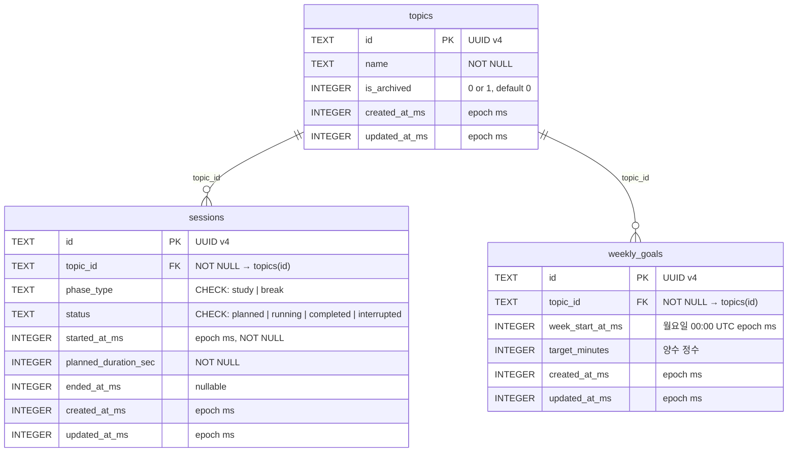

# 데이터 모델

> 생성일: 2026-03-20 | DB: SQLite (embedded via tauri-plugin-sql)

## 개요

모든 도메인 데이터는 SQLite를 단일 사실원천으로 사용한다. 3개 테이블(`topics`, `sessions`, `weekly_goals`)이 존재하며, 통계는 `sessions` 테이블에서 파생 계산된다.

## ER 다이어그램

## 테이블 상세

### topics

학습 주제를 관리한다. 아카이브 상태로 논리 삭제.

| 컬럼 | 타입 | 제약 | 설명 |
|------|------|------|------|
| id | TEXT | PK, NOT NULL | UUID v4 |
| name | TEXT | NOT NULL | 주제 이름 |
| is_archived | INTEGER | NOT NULL, DEFAULT 0 | 0=활성, 1=아카이브 |
| created_at_ms | INTEGER | NOT NULL | 생성 시각 (epoch ms) |
| updated_at_ms | INTEGER | NOT NULL | 갱신 시각 (epoch ms) |

**TS 타입:** `Topic { id, name, isArchived: boolean, createdAtMs, updatedAtMs }`

### sessions

포모도로 학습/휴식 세션 기록. 타이머는 timestamp 기반으로 모델링.

| 컬럼 | 타입 | 제약 | 설명 |
|------|------|------|------|
| id | TEXT | PK, NOT NULL | UUID v4 |
| topic_id | TEXT | FK → topics(id), NOT NULL | 소속 주제 |
| phase_type | TEXT | CHECK(study/break), NOT NULL | 세션 유형 |
| status | TEXT | CHECK(planned/running/completed/interrupted), NOT NULL | 세션 상태 |
| started_at_ms | INTEGER | NOT NULL | 시작 시각 (epoch ms) |
| planned_duration_sec | INTEGER | NOT NULL | 계획 길이 (초) |
| ended_at_ms | INTEGER | nullable | 종료 시각 (epoch ms) |
| created_at_ms | INTEGER | NOT NULL | 레코드 생성 (epoch ms) |
| updated_at_ms | INTEGER | NOT NULL | 레코드 갱신 (epoch ms) |

**TS 타입:** `Session { id, topicId, phaseType: 'study'|'break', status: SessionStatus, startedAtMs, plannedDurationSec, endedAtMs, createdAtMs, updatedAtMs }`

**상태 전이:** `planned → running → completed | interrupted`

### weekly_goals

주제별 주간 학습 목표. 주제+주 조합으로 유일.

| 컬럼 | 타입 | 제약 | 설명 |
|------|------|------|------|
| id | TEXT | PK, NOT NULL | UUID v4 |
| topic_id | TEXT | FK → topics(id), NOT NULL | 소속 주제 |
| week_start_at_ms | INTEGER | NOT NULL | 주 시작 시각 (월요일 00:00 UTC, epoch ms) |
| target_minutes | INTEGER | NOT NULL | 목표 시간 (분) |
| created_at_ms | INTEGER | NOT NULL | 레코드 생성 (epoch ms) |
| updated_at_ms | INTEGER | NOT NULL | 레코드 갱신 (epoch ms) |

**TS 타입:** `WeeklyGoal { id, topicId, weekStartAtMs, targetMinutes, createdAtMs, updatedAtMs }`

## 인덱스

| 인덱스 | 테이블 | 컬럼 | 조건 | 목적 |
|--------|--------|------|------|------|
| idx_sessions_topic_id_started_at_ms | sessions | topic_id, started_at_ms | — | 주제+기간별 세션 조회 성능 |
| idx_sessions_status | sessions | status | — | 상태별 세션 조회 |
| idx_sessions_single_running | sessions | status | WHERE status='running' | **UNIQUE** — 단일 running 세션 보장 |
| idx_weekly_goals_topic_id_week_start_at_ms | weekly_goals | topic_id, week_start_at_ms | — | 주제+주별 목표 조회 |
| idx_topics_is_archived | topics | is_archived | — | 활성 주제 필터링 |

## FK 정책

모든 FK는 `ON DELETE RESTRICT` — 주제 삭제 시 연결된 세션/목표가 있으면 삭제 거부.
주제는 삭제 대신 **아카이브** (`is_archived = 1`)로 논리 삭제한다.

## 매핑 규칙

- DB row: `snake_case` (예: `topic_id`, `started_at_ms`)
- TS 객체: `camelCase` (예: `topicId`, `startedAtMs`)
- 매핑은 **repository/adapter 경계에서만** 수행 (`*-mappers.ts`)
- `boolean` ↔ `INTEGER(0|1)` 변환 포함

## 마이그레이션 이력

| 번호 | 파일 | 내용 |
|------|------|------|
| 001 | `001_initial_schema.sql` | topics, weekly_goals, sessions 테이블 생성 |
| 002 | `002_indexes.sql` | 성능 인덱스 4개 생성 |
| 003 | `003_single_running_session_guard.sql` | 고아 running 세션 정리 + UNIQUE partial index |
